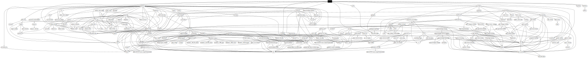

# mepower

Scrape Central Maine Power's [outage portal](https://ecmp.cmpco.com/OutageReports/CMP.html) and return street-level newline-delimited JSON records.

## Example Usage

```bash
mepower | jq
```

```json
{
  "outage_update": "Oct 10, 2022 11:55 AM",
  "county": "Cumberland",
  "county_total": "173,602",
  "county_out": "50",
  "muni": "Standish",
  "muni_total": "5,348",
  "muni_out": "50",
  "street": "Royal Pine Dr",
  "street_out": "35",
  "street_restoration": "Oct 10, 2022 12:30 PM",
  "message": ""
}
{
  "outage_update": "Oct 10, 2022 11:55 AM",
  "county": "Cumberland",
  "county_total": "173,602",
  "county_out": "50",
  "muni": "Standish",
  "muni_total": "5,348",
  "muni_out": "50",
  "street": "Susan Dr",
  "street_out": "13",
  "street_restoration": "Oct 10, 2022 12:30 PM",
  "message": ""
}
{
  "outage_update": "Oct 10, 2022 11:55 AM",
  "county": "Cumberland",
  "county_total": "173,602",
  "county_out": "50",
  "muni": "Standish",
  "muni_total": "5,348",
  "muni_out": "50",
  "street": "Tuckenuck Rd",
  "street_out": "2",
  "street_restoration": "Oct 10, 2022 12:30 PM",
  "message": ""
}
{
  "outage_update": "Oct 10, 2022 11:55 AM",
  "county": "Lincoln",
  "county_total": "28,307",
  "county_out": "2",
  "muni": "Boothbay",
  "muni_total": "2,951",
  "muni_out": "2",
  "street": "Eagle Ridge Rd",
  "street_out": "2",
  "street_restoration": "Oct 10, 2022 01:00 PM",
  "message": ""
}
```

## Installation

```bash
cargo install --git https://github.com/hrbrmstr/mepower --branch batman
```

## Building (release)

Assuming you use [Just](https://github.com/casey/just):

```bash
git clone git@github.com:hrbrmstr/mepower && \
	cd mepower && \
	just release
```

## Dependencies

- [SBOM](bom.xml)

